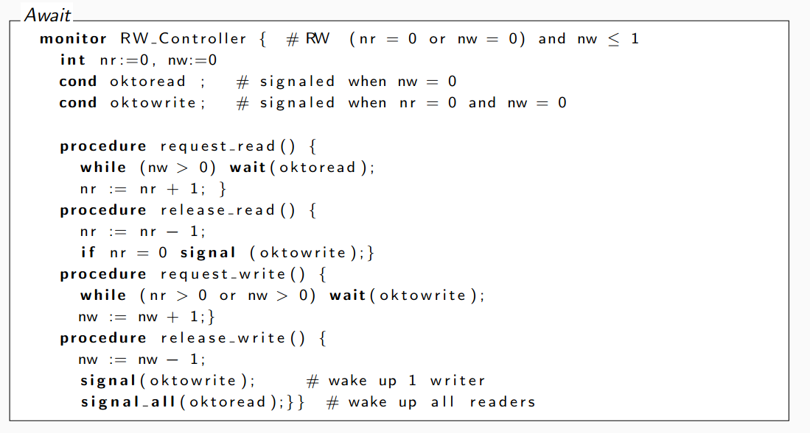
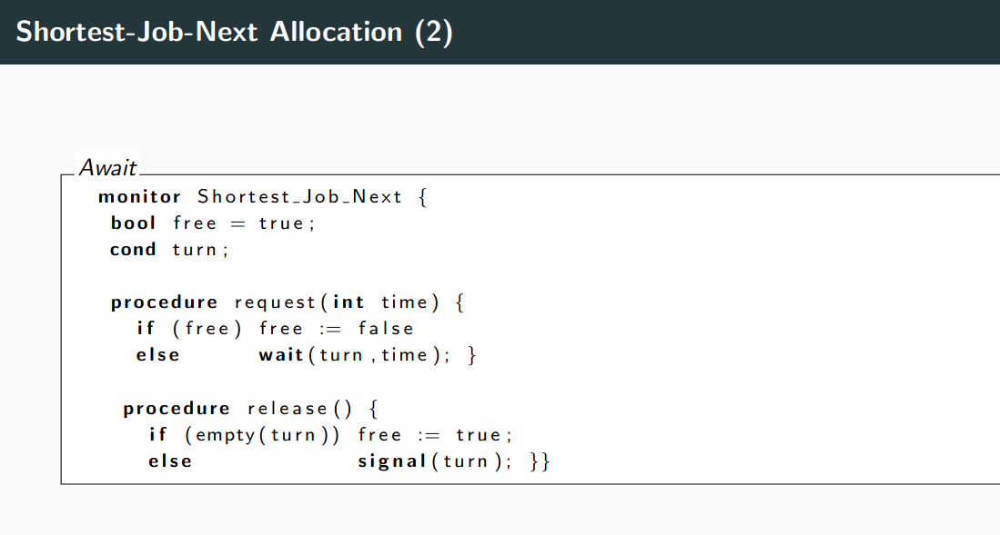
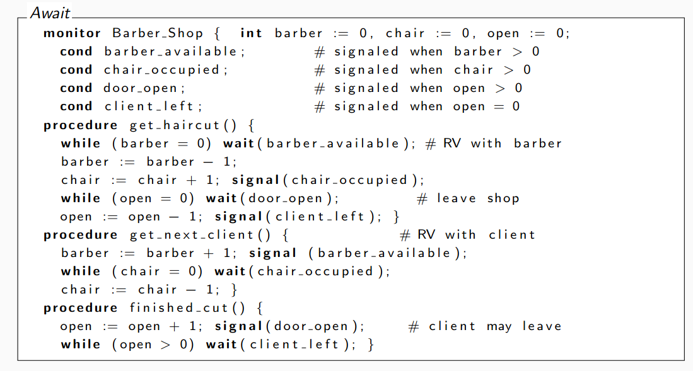
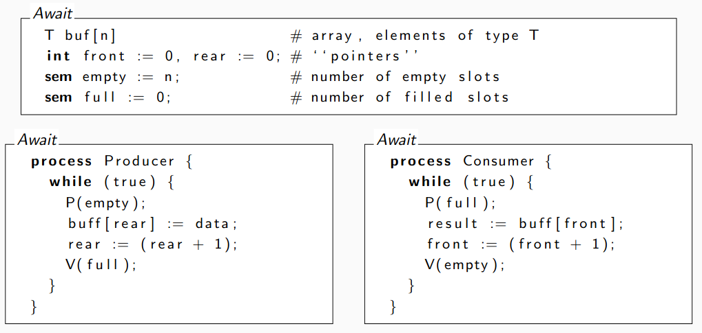

# List of Useful Patterns to remember

## Bounded Buffer with Monitor 

A bounded buffer is an array with limited space.
We use a single counter to keep track of where we are in the array. 
It has N slots. We put data in the buffer when we can, and remove it when there is space. 

Here is the implementation: 

## Reader and Writer problem with monitor 

Readers and writer problem involves having readers and writers accessing resources. 

Tips: 
- Use variables to keep track of how many readers and writers there are. 
- Define the invariant based on the variables 

## Shortest job next with monitor

Allocate resources based on what sources are used. 
See that we queue process based on their time of completion, and then take the shortest job first when we signal. 

## Barber Shop with monitor

Here is a few tips: 
- Use while statements around wait, because we may need to recheck the condition when the process is awaken again
- Increment/decrement only after the while statement (makes a good pattern).
- Consider the invariant and when we should signal the processes 

## Producer/Consumer with semaphore

This patterns works well!
- Two indexes to keep track of where the buffer are: rear and front 
- Two semaphores
  - Empty has N permits, which represents how many empty slots there are
  - Full is initially zero

The producer:
- We do a P to check if there are any empty slots, and then we take that permit 
- We do a V operation on `full` when we produced something, signaling that we have produced something 
- We increment our read pointer by one 

The consumer: 
- Does a P on full to see if there have been anything produces
- Does a V after consuming 

This solution does not have any critical section because the pointers are locally to does producer and consumer

What if we want multiple consumers and producers?
- Simple: two new semaphores that acts as mutexes for the consuming an producing
  - They are around the CS